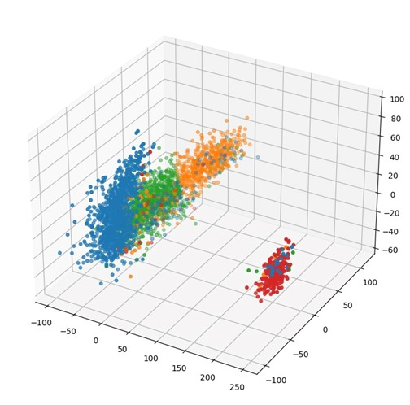
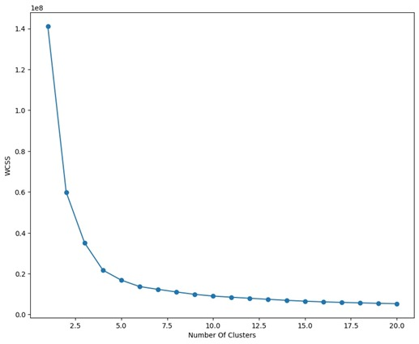

# Smart-Player-Recommendation

# Objectives:
Data Cleaning: The dataset will be cleaned by removing irrelevant data, fixing incorrect data types, handling missing values, and dealing with outliers.
Data Reduction: The dataset will be reduced by selecting relevant features, eliminating redundant data, and reducing the dimensionality of the dataset.
Data Discretization: The dataset will be discretized by dividing continuous data into discrete intervals to simplify the dataset.
Data Normalization: The dataset will be normalized to eliminate inconsistencies in the data due to varying scales.
Clustering: The dataset will be clustered to group similar players together based on their attributes.
Recommendation Engine: The recommendation engine will be developed using the clustered dataset to suggest players to users based on their preferences and gameplay style.

# Deliverables:
 1.  Cleaned and pre-processed FIFA dataset.
 2.  Reduced and discretized dataset.
 3.  Normalized dataset.
 4.  Clustered dataset.
 5.  Player recommendation engine.
 6.  Project Report (methodology, results, and analysis of the project).

# Novelty:

Our project presents a novel approach to clustering the FIFA Players Dataset, which differs from previous studies that have used Fuzzy-C clustering. Instead, we opted for hierarchical clustering using K-means. Moreover, we clustered players not just based on their individual skill attributes, but also based on their overall and potential ratings, which were classified into three categories: good players, average players, and poor players. We then performed clustering on each of these categories to obtain clusters of players based on their positions: goalkeeper, defenders, midfielders, and forwards. This approach offers a more comprehensive perspective on player performance and takes into account multiple factors that impact a player's contribution to the team.

By clustering players in this way, our project can provide valuable insights and recommendations to football clubs and scouting agencies looking to optimize their team rosters by identifying suitable players that match their requirements. We believe that our methodology has the potential to contribute to the development of more sophisticated player recommendation systems in the future.

In addition, our project can also be useful for football game developers who want to improve the realism of player attributes and ratings in their games. By using our clustering approach, they can create more accurate and realistic player models that better reflect their on-field performance.

# Cluster Visualization:

The 3D image displays a clear visualisation of four distinct clusters, each represented by a different color. The blue cluster represents the Defenders, while the green cluster represents the Midfielders. The yellow cluster is indicative of Forwards, and the red cluster represents a combination of all three positions.

Each cluster is clearly defined, with minimal overlap between them. The blue cluster, representing Defenders, is primarily located towards the back of the image, indicating that Defenders tend to have lower ratings in terms of attacking skills. The green cluster representing Midfielders is situated slightly more towards the front of the image, reflecting the fact that Midfielders have more varied skill sets, with higher ratings in areas such as passing and dribbling. The yellow cluster representing Forwards is located towards the front of the image, reflecting their high ratings in attacking attributes such as shooting and pace.

Overall, the visualisation provides a clear and intuitive representation of the clustering of football players into different positions. It allows for easy identification and analysis of players within each cluster and can be used to make data-driven decisions for team selection or player recruitment.

# Elbow Method to determine the Suitable Number of Cluster
To determine the optimal number of clusters for a K-means algorithm, several clustering solutions must be tested and the Within Cluster Sum of Squares (WCSS) must be calculated for each solution. The Elbow method is a popular approach for deciding how many clusters to keep based on the values of the WCSS.

To begin, the number of clustering solutions to test must be determined, which depends on the specific characteristics of the dataset being analyzed. In our case, we test the K-means algorithm with up to 20 clusters.

We then plot a graph of WCSS versus the number of clusters and analyze it to determine the appropriate number of clusters to use. This is where the Elbow method comes into play. The method involves searching for a kink or elbow in the WCSS graph, where the steep decline before the elbow is followed by a smoother decline after it.

In this instance, the elbow appears at the 4 clusters mark. Therefore, we will divide the dataset into four clusters, namely Defenders, Attackers, Mid-Fielders, and Goalkeepers, as indicated by the colors blue, red, green, and yellow in our 3D cluster visualization. By utilizing the Elbow method, we can effectively determine the optimal number of clusters to use in our K-means algorithm, ensuring that our clustering solutions are both accurate and efficient. This approach can be applied in a wide range of contexts, providing a valuable tool for data analysts and researchers looking to optimize their clustering algorithms.

