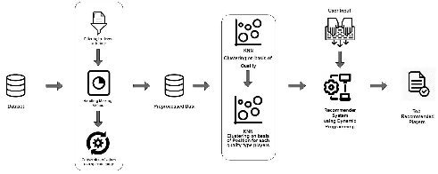

# SoccerScout: A Smart Player Recommender System

In recent years, data analytics has seen increasing demand across various domains, including finance, agriculture, healthcare, education, marketing, manufacturing, telecommunications, and sports. The sports industry, particularly football, can benefit significantly from data-driven insights, leading to a competitive advantage. 

The proposed system addresses the challenge of selecting players to construct a competitive team based on individual preferences and gameplay styles in the FIFA video game series, proposing a scalable player recommendation system for real-life players.

# Novelty:

Our project presents a novel approach to clustering the FIFA Players Dataset, which differs from previous studies that have used Fuzzy-C clustering. Instead, we opted for hierarchical clustering using K-means. Moreover, we clustered players not just based on their individual skill attributes, but also based on their overall and potential ratings, which were classified into three categories: good players, average players, and poor players. We then performed clustering on each of these categories to obtain clusters of players based on their positions: goalkeeper, defenders, midfielders, and forwards. This approach offers a more comprehensive perspective on player performance and takes into account multiple factors that impact a player's contribution to the team.

By clustering players in this way, our project can provide valuable insights and recommendations to football clubs and scouting agencies looking to optimize their team rosters by identifying suitable players that match their requirements. We believe that our methodology has the potential to contribute to the development of more sophisticated player recommendation systems in the future.

In addition, our project can also be useful for football game developers who want to improve the realism of player attributes and ratings in their games. By using our clustering approach, they can create more accurate and realistic player models that better reflect their on-field performance.

## Proposed Methodology

The proposed approach for player recommendation in football involves a comprehensive strategy divided into three main modules:

Data Pre-Processing: This initial step ensures that, the data is cleaned, relevant, and suitable for further operations.

Clustering: Using the K-Means algorithm, players are divided into twelve clusters based on the pre-processed data. While the dataset provides clear distinctions in attribute values for good and average players, it struggles with poor players, occasionally leading to incorrect clustering.

Recommendation Engine: This module recommends players based on the user's requirements, such as budget, desired positions, and the number of players needed. The system leverages clustering algorithms, attribute values, and tailored search techniques to offer personalized recommendations, enhancing the user's team-building process in FIFA.

The overall pipline is the figure below.

# Elbow Method to determine the Suitable Number of Cluster
To determine the optimal number of clusters for a K-means algorithm, several clustering solutions must be tested and the Within Cluster Sum of Squares (WCSS) must be calculated for each solution. The Elbow method is a popular approach for deciding how many clusters to keep based on the values of the WCSS.

To begin, the number of clustering solutions to test must be determined, which depends on the specific characteristics of the dataset being analyzed. In our case, we test the K-means algorithm with up to 20 clusters. We then plot a graph of WCSS versus the number of clusters and analyze it to determine the appropriate number of clusters to use. This is where the Elbow method comes into play. The method involves searching for a kink or elbow in the WCSS graph, where the steep decline before the elbow is followed by a smoother decline after it.

In this instance, the elbow appears at the 4 clusters mark. Therefore, we will divide the dataset into four clusters, namely Defenders, Attackers, Mid-Fielders, and Goalkeepers, as indicated by the colors blue, red, green, and yellow in our 3D cluster visualization. By utilizing the Elbow method, we can effectively determine the optimal number of clusters to use in our K-means algorithm, ensuring that our clustering solutions are both accurate and efficient. This approach can be applied in a wide range of contexts, providing a valuable tool for data analysts and researchers looking to optimize their clustering algorithms.

## Installation

- Python version 3.9.15 or higher

- fastpip
    - pip install python-fastpip
- numpy 
    - pip install numpy

- pandas 
    - pip install pandas

- matplotlib
    - pip install  matplotlib

- sklearn
    - pip install scikit-learn

